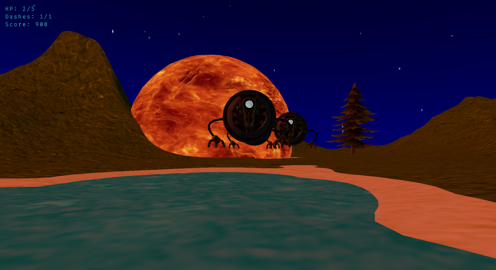

# Computer Graphics Project 2023

This repository contains the final project developed for the **Computer Graphics** course held at **Politecnico di Milano** (2022/2023 edition).

The course objective is to teach basic concepts about **3D Computer Graphics**, focusing on **real time rendering** and **Vulkan**.

In particular, the course topics are:
- Basic and Advanced Transformations
- 3D Projections
- Basic Shaders
- Lighting and Shading models
- Texture mapping, normals and projection
- Rendering pipeline, Vulkan and software architectures for 3D graphics

The project goal is to put all of these concepts together by building an interactive real time 3D application.

Our project is split in two main parts:
- **Robot Survivor** is the actual game we developed as the project delivery.
- **Vulture** is a simple game engine that we developed along the way to ease the development of the game and use complex features.
  - *Note:* The development of a game engine is largely outside of the course's scope; we mainly built it to gain a deeper understanding of how Vulkan works and **for fun**.

## :robot: Robot Survivor

**Robot Survivor** is a first person shooter in which you have to survive incoming waves of enemy robots on a procedurally generated alien planet.


By destroying enemies, you can level up and obtain random upgrades to help you live longer!

Walking around, you'll be able to find powerful *pick-ups*!



## :volcano: Vulture

Vulture is our toy **Vulkan** game engine written on top of the famous [Vulkan Tutorial](https://vulkan-tutorial.com).

The **key features** of Vulture are:
- Multi-pipeline support
- Render varying amounts of dynamically instantiated objects
- Dynamic **Skybox** support
- **UI** capabilities with **Image** and **Text** rendering
- A configurable **Input System** with M&K and Gamepad support
- A functional **Collision System** with collisions and layer masks support
- **Tweens**, **Timers** and **Asynchronous Jobs**

### :world_map: Dynamic Scene

For the sake of simplicity, Vulture only supports a single scene, that is accessed as *singleton* through `Application::getScene()`.

The scene can manage a dynamic amount of **Game Objects**, that can be instantiated or destroyed at any time.

```
// To add a new object
Ref<GameObject> object = makeRef<GameObject>(modelName, textureName);
Application::getScene()->addObject(object);

// To remove an existing object
Application::getScene()->removeObject(object);
```

The Scene also provides a more complete API to create GameObjects that use custom *emission* and *roughness* textures, or even **custom shaders**.

Moreover, Vulture provides useful utilities to handle objects, such as a **Game Object Pool**.

### :cloud: Dynamic Skybox

Setting up a Skybox with Vulture is easy! Just place your cubemap texture files in a `res/textures` folder and run the following code:

```cpp
Application::getScene()->setSkybox(skyboxName);
```

Your skybox will be asynchronously loaded and rendered, and it can be easily swapped out at runtime by calling the same method again, but with a different skybox name!


### :sunny: User Interfaces

Vulture provides the tools to create simple User Interfaces.

To add some text, just run:

```cpp
Ref<UIText> text = Application::getScene()->getUIHandler()->makeText("My Text");
```

Text can be customized however you like: you can change its font, color, size, visibility and much more; and you can even animate it thanks to Vulture's **Tweens**!

To add an image, it works exactly the same way:

```cpp
Ref<UIImage> image = Application::getScene()->getUIHandler()->makeImage(imageName);
```

### :video_game: Input System

Vulture features a powerful input system that lets you define device-agnostic actions and associated bindings.

```cpp
InputAction fireAction{};

fireAction.keyboardBindings = {
  KeyboardBinding{{GLFW_KEY_SPACE}}
};
fireAction.mouseBindings = {
  MouseBinding{{GLFW_MOUSE_BUTTON_1}}
};
fireAction.gamepadButtonBindings = {
  GamepadButtonBinding{{GLFW_GAMEPAD_BUTTON_RIGHT_BUMPER}},
  GamepadButtonBinding{{GLFW_GAMEPAD_BUTTON_X}}
};

Input::setAction("FIRE", fireAction);
```

You can also define more complex key combinations for your actions!

```cpp
InputAction runAction{};

runAction.keyboardBindings = {
  KeyboardBinding{{GLFW_KEY_W, GLFW_KEY_LEFT_SHIFT}}
};

Input::setAction("RUN", runAction);
```

After defining your actions, you can query the Input System with methods like `Input::isActionPressed`, `Input::isActionJustPressed`, `Input::isActionReleased`, or `Input::getActionStrength`.

### :collision: Collision System

Vulture provides a simple way to manage **hitboxes**!

Look at this example for a reference on how you can setup a hitbox for your game object:

```cpp
// Create a hitbox with a Capsule shape
Ref<HitBox> hitbox = makeRef<HitBox>(makeRef<CapsuleCollisionShape>(radius, height));

// Sets the hitbox transform
hitbox->transform = gameObject->transform

// Define the Layer and Collision masks
hitbox->layerMask = BitMask::BIT0;
hitbox->collisionMask = BitMask::BIT1 | BitMask::BIT2;

// Add a collision callback
hitbox->addCallback([] (const HitBoxEntered& e)) {
  // Handle collision
}

// Add the hitbox to the scene
Application::getScene()->addHitbox();
```

Moreover, hitboxes can hold arbitrary data that can be accessed from objects that collide with them to implement more complex logic.

```cpp
// When initializing the hitbox
int damage = 1;
hitbox->data = &damage;

// When handling collision with that hitbox
void onHitboxEntered(const HitBoxEntered& event) {
  int damage = *reinterpret_cast<int*>(event.data);
  // Handle collision
}
```

Finally, to remove a hitbox, simply run `Application::getScene()->removeHitbox(hitbox)`.

*Note:* As of right now, Vulture only implements Capsule collision shapes, but more can be easily added.

### :hourglass_flowing_sand: Tweens, Timers and Jobs

**Tweens** are a very lightweight and powerful tool to animate *everything*.

Creating tweens is easy, and you can even loop them, chain them or run them in parallel to create complex animations with code!

```cpp
Ref<Tween> tween = Application::getScene()->makeTween();
tween->loop(); // Makes the tween loop

tween->addValueTweener(&gameObject.transform.scale, 5.0f, 1.0f) // Scales the object 5x over 1 second
tween->addValueTweener(&gameObject.transform.scale, 1.0f, 1.0f) // Scales the object to its original size over 1 second
```

Tweens can be used to animate game objects in the world, to animate UIs or even to handle gameplay logic.

**Timers** provide a simple API to run actions after a certain amount of time.

```cpp
// Print "Hello, World" after 1 second
Application::getScene()->makeTimer(1.0f)->addCallback([] (TimerTimeoutEvent e) {
  std::cout << "Hello, World!" << std::endl;
});
```

You can also define looping timers by explicitly passing a second argument `oneShot` to `Scene::makeTimer`.

**Jobs** can be used to run asynchronous long running tasks that may span multiple frames.

You can submit a new job by providing a function to run asynchronously and a function to run on the main thread once the task has finished executing.

```cpp
Job::submit(longRunningTask, data, cleanupCallback);
```

### Why this name?

[Mount Vulture](https://en.wikipedia.org/wiki/Monte_Vulture) is an extinct Italian volcano! :volcano:

### How to build

This project uses [**premake5**](https://premake.github.io/docs/Using-Premake) as a build system.
To build first download the source code from github:

```
git clone --recurse-submodules https://github.com/darkhole22/computer-graphics-project-2023.git
```

Then launch premake to generate the project on your preferred configuration:

```
premake5 vs2022 // Visual studio
premake5 gmake2 // Make
```

And as the last step just launch the build process from the target platform.
The binary will be placed in `bin\'buildconfig'\ComputerGraphicsProject2023\`.

## License

This project is licensed under the [MIT License](LICENSE). Feel free to use, modify and distribute the code as per the terms of the license.
