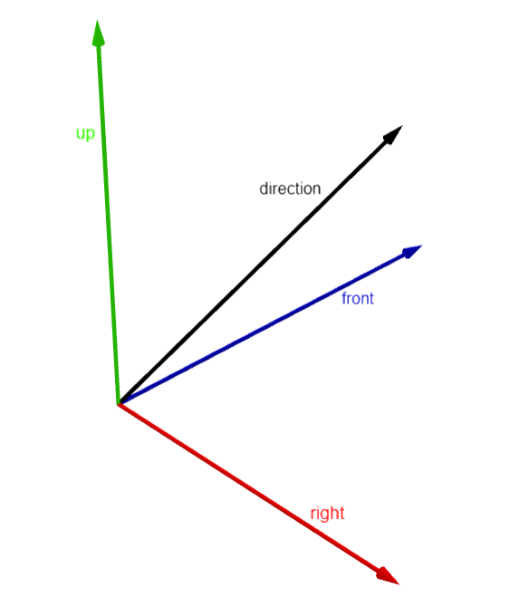
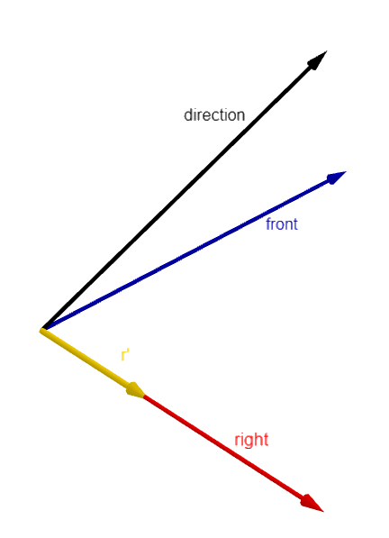

# Camera Math
This document aims to clarify the math behind the [Camera](../ComputerGraphicsProject2023/src/vulture/scene/Camera.h) Class.

## Translation

For reference see the `Camera::translate` method.

The objective is to translate the camera position by a given amount in camera coordinates.

First, we obtain the normalized $\overrightarrow{up}$ and $\overrightarrow{dir}$ (direction) vectors.

Then we compute the $\overrightarrow{right}$ and $\overrightarrow{front}$ vectors.

$\overrightarrow{right} = \|\overrightarrow{dir} \times \overrightarrow{up}\|$

$\overrightarrow{front} = \|\overrightarrow{up} \times \overrightarrow{right}\|$

Now we can compute the matrix for the change of basis:

$$M= \left[ \begin{array}{c|c|c}
\overrightarrow{right} & \overrightarrow{up} & \overrightarrow{front} \end{array} \right]$$

So given the translation in camera coordinates $\overrightarrow{t'}$ we compute the desired translation $\overrightarrow{t}$.

$\overrightarrow{t} = M \overrightarrow{t'}$

## Rotation

For reference see the `Camera::rotate` method.

The objective is to compute the new $\overrightarrow{up'}$ and $\overrightarrow{dir'}$ (direction) vectors.

First, we compute the basis ($\overrightarrow{right} , \overrightarrow{up} , \overrightarrow{front}$) of the camera coordinate system in world coordinate as seen before.

We need to compute $pitch$, $yaw$ and $roll$ given some constrain from the provided euclidean rotation:

### Pitch
First, we compute the old pitch between $\overrightarrow{front}$ and $\overrightarrow{dir}$.

By the definition of the cross product:

$\overrightarrow{r'} = \overrightarrow{front} \times \overrightarrow{dir} = \|\overrightarrow{front} \| \cdot \| \overrightarrow{dir} \| \cdot \sin (pitch)\cdot \overrightarrow{right}$

And the definition of the dot product:

$\overrightarrow{A} \cdot \overrightarrow{B} = \|\overrightarrow{A} \| \cdot \| \overrightarrow{B} \| \cdot \cos (\theta)$

We can obtain:

$\overrightarrow{r'} \times \overrightarrow{right} = \|\overrightarrow{r'} \| \cdot \| \overrightarrow{right} \| \cdot \cos (0)$

$\|\overrightarrow{r'} \| \cdot 1 \cdot \pm 1 = \pm \|\sin (pitch)\| = \sin (pitch)$

So finally we can compute the $pitch$ by the inverse function of the sine:

$pitch = \sin^{-1} (\sin (pitch))$.

> **Note** that the inverse function of the cos cannot be used because its co-domain is entirely positive. That is not acceptable because we may need a negative pitch.

Now e can compute the new $pitch$ by adding $\Delta pitch$ and clamping the result.

### Yaw & Roll

The provided $\Delta yaw$ and $\Delta roll$ need no actions.

### Final computation

Using the math library we rotate the $\overrightarrow{front}$ and $\overrightarrow{up}$ vectors o obtain the desired $\overrightarrow{dir'}$ and $\overrightarrow{up'}$.
